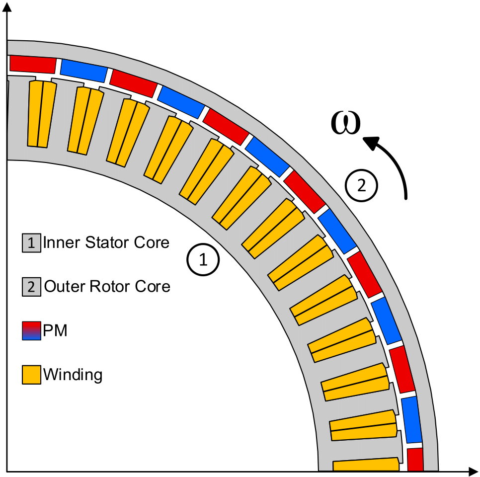

# ⚙️ Multi-Objective Hub-Motor Design Optimization
### Repository language: English

This repository contains the complete framework for the design optimization of an outer-rotor permanent magnet (ORPM) hub motor for electric vehicle applications. The project's core focus is resolving the inherent design trade-offs between electromagnetic performance, efficiency, and manufacturing cost by leveraging nature-inspired metaheuristic algorithms.

---

## 🎯 Project Objectives

The design process was formulated as a multi-objective optimization problem with four competing goals:

* [cite_start]**Maximize Average Torque ($f_1: T_{avg}$)**: To enhance vehicle acceleration and performance. [cite: 212, 419]
* [cite_start]**Minimize Copper Losses ($f_2: P_{cu}$)**: To improve motor efficiency, especially at its rated operating speed. [cite: 446]
* [cite_start]**Maximize Power Factor ($f_3: P.F.$)**: To ensure efficient power delivery from the inverter. [cite: 455]
* [cite_start]**Minimize Effective Cost ($f_4: E.C.$)**: To ensure the commercial viability of the motor design. [cite: 424, 425]

---

## 🔬 Methodology

The optimization framework combines high-fidelity electromagnetic modeling with a robust, multi-stage design process.

### 1. Modeling
The electromagnetic performance of the motor is evaluated using a high-fidelity 2D Finite Element Analysis (FEA) model. [cite_start]The analysis is performed with the **[EMDLAB computational electromagnetics solver](https://github.com/EMDLAB-Package/emdlab-win64)**, and the results are validated against the industry-standard **Ansys Electronics Desktop (Ansys Maxwell)** software to ensure the highest accuracy. [cite: 352]

### 2. Sensitivity Analysis
[cite_start]A variance-based comprehensive sensitivity analysis was first performed to identify the most influential geometric parameters affecting the motor's performance. [cite: 483, 484] This step ensures that the optimization effort is focused on the most impactful variables.

### 3. Multi-Objective Optimization
[cite_start]To solve the complex design problem, a comparative study was conducted using three distinct metaheuristic algorithms. [cite: 530] This approach ensures a thorough exploration of the design space to find the best possible trade-off solutions. The workflow for each algorithm is detailed in its respective flowchart.

| Algorithm                                          | Flowchart                                                 |
| :------------------------------------------------- | :-------------------------------------------------------- |
| **Multi-Objective Grey Wolf Optimizer (MOGWO)** |        |
| **Multi-Objective Particle Swarm Optimization (MOPSO)**|      |
| **Non-dominated Sorting Genetic Algorithm II (NSGA-II)**|  |

---

## 📊 Key Results

The optimization process yielded a set of non-dominated, optimal solutions, visualized in the Pareto front below. [cite_start]These results represent the best possible trade-offs between the conflicting design objectives. [cite: 658]

[cite_start]From the set of optimal solutions, a final design was selected that demonstrates significant improvements over the initial configuration. [cite: 832]

| Performance Metric              | Initial Design | **Optimal Design** | Improvement |
| :------------------------------ | :------------- | :----------------- | :---------- |
| Average Torque ($T_{avg}$)        | 229.40 N.m     | **273.14 N.m** | **+19.0%** |
| Effective Cost ($E.C.$)          | 163.95 USD     | **147.86 USD** | **-9.8%** |
| Power Factor ($P.F.$)           | 0.65           | **0.67** | **+3.1%** |
| Copper Losses ($P_{cu}$)        | 5890.56 W      | 6011.49 W          | -2.0%       |

[cite_start]*This data is from the final comparison between the initial and optimal designs.* [cite: 839, 851]

[cite_start]The final design achieves a remarkable **19% increase in average torque** while simultaneously **reducing the effective material cost by nearly 10%**. [cite: 841, 844]

---

## 📂 Files and Structure

This repository is organized into distinct sections, each corresponding to a phase of the project. The MATLAB scripts, data, and relevant files for each section are contained within a `.zip` file.

* `01_Initial_Design/`: Contains the scripts and parameters for the initial, pre-optimization motor design.
* `02_Sensitivity_Analysis/`: Includes the scripts used to perform the comprehensive sensitivity analysis.
* `03_Optimization/`: Houses the implementation files for the MOGWO, MOPSO, and NSGA-II optimization algorithms.
* `04_Final_Design/`: Contains the parameters and performance data for the final, selected optimal design.
* `Figures/`: Stores all the plots and diagrams used in this README and for the project's results.

---

## 📧 Accessing the Files

Please note that the `.zip` files in this repository are password-protected. To purchase the complete project files and gain access, please contact me at:

**hamidsharifi32@gmail.com**

---

### How to Use

1.  Clone the repository to your local machine.
2.  Contact the author at the email above to purchase and receive the password for the `.zip` files.
3.  Unzip the files in each section to access the MATLAB scripts and data.
4.  Run the scripts in a MATLAB environment.
